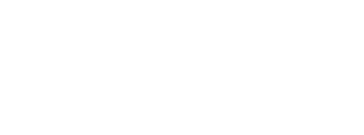

# Virtualization as Abstraction Layers

## Core Idea: Abstraction Is the Engine of Computing

Every major leap in computing has been an **abstraction** -- a layer that
hides complexity below and exposes a simpler interface above. Cloud
computing is the latest and most dramatic abstraction, built on top of
decades of prior abstractions.

Understanding the full abstraction tower -- from transistors to cloud
services -- is the key to understanding virtualization, containers, and
why cloud infrastructure works the way it does.


---

## What Is Virtualization?

Virtualization is the creation of a **virtual (software-based) version**
of something that is normally physical: a server, a network, a storage
device, or even an entire operating system.

The key insight: virtualization **decouples** the logical resource from
the physical resource. A virtual machine does not know (or care) which
physical server it runs on. A virtual network does not know which
physical cables carry its packets. This decoupling is what makes cloud
possible.

### Why Virtualization Matters for Cloud

Without virtualization, one physical server = one workload. With
virtualization:

- Multiple workloads share one physical server (consolidation)
- Workloads can move between physical servers (migration)
- Workloads are isolated from each other (security)
- Resources can be provisioned in seconds, not weeks (agility)

---

## Hypervisors: The Foundation

A **hypervisor** (also called a Virtual Machine Monitor, or VMM) is the
software layer that creates and manages virtual machines. It sits between
the physical hardware and the virtual machines, mediating access to CPU,
memory, storage, and network.

### Type-1 Hypervisors (Bare-Metal)

Run directly on the hardware, with no host operating system underneath.
They are the most common type in cloud data centers because they offer
the best performance and security.


### Type-2 Hypervisors (Hosted)

Run on top of a conventional operating system. The host OS manages
hardware; the hypervisor runs as an application. Used for development
and testing, not production cloud.


---

## CPU Virtualization: Rings and Traps

To understand how a hypervisor works, you need to understand CPU
**privilege rings**.

### x86 Privilege Rings


### The Virtualization Challenge

The guest OS was written to run in Ring 0 and execute privileged
instructions (like modifying page tables or configuring interrupts).
But the hypervisor already occupies Ring 0. The guest must be tricked
or assisted.

### Three Approaches to CPU Virtualization

**1. Binary Translation (Software)**
The hypervisor scans the guest OS code and replaces privileged
instructions with safe equivalents at runtime. This was VMware's
original approach. Slow but requires no guest OS modifications.

**2. Paravirtualization**
The guest OS is modified to call the hypervisor explicitly (via
"hypercalls") instead of executing privileged instructions. Xen
pioneered this. Fast but requires guest OS changes.

**3. Hardware-Assisted Virtualization (Intel VT-x / AMD-V)**
The CPU itself adds a new privilege level below Ring 0, called
**VMX root mode** (Intel) or **SVM** (AMD). The hypervisor runs in
VMX root mode; the guest OS runs in Ring 0 normally but is
transparently trapped by the CPU when it executes privileged
instructions.


---

## Memory Virtualization

Memory virtualization is arguably more complex than CPU virtualization.
The hypervisor must give each VM the illusion of a contiguous, private
physical address space, while actually mapping to the real physical
memory of the host.

### The Double Translation Problem

Without virtualization:


With virtualization:


### Approach 1: Shadow Page Tables

The hypervisor maintains a **shadow page table** that directly maps guest
virtual addresses to host physical addresses. When the guest modifies its
page tables, the hypervisor intercepts (traps) and updates the shadow.

- Pros: Fast lookups (single translation)
- Cons: Expensive to maintain (every guest page table write causes a trap)

### Approach 2: Extended Page Tables (EPT) / Nested Paging

Intel EPT (and AMD NPT) add hardware support for a **second level of
page tables**. The CPU walks both levels automatically.


---

## I/O Virtualization

I/O (network, storage, GPU) is the hardest part of virtualization because
physical devices are complex and stateful.

### The Problem

Each VM needs access to network interfaces, disks, and potentially GPUs.
But there is only one physical NIC and one physical disk controller.

### Approach 1: Device Emulation

The hypervisor presents a **virtual device** (e.g., an emulated Intel
e1000 NIC) to the guest. The guest uses its standard driver; the
hypervisor translates I/O operations to the real hardware.

- Pros: Any guest OS works (uses standard drivers)
- Cons: Slow (every I/O operation involves hypervisor intervention)

### Approach 2: Paravirtual I/O (virtio)

The guest installs a special **virtio driver** that communicates with the
hypervisor via shared memory ring buffers instead of emulating a physical
device. This skips the emulation overhead.


### Approach 3: SR-IOV (Single Root I/O Virtualization)

The physical device itself presents **multiple virtual functions (VFs)**,
each of which can be assigned directly to a VM. The VM talks to the
hardware with no hypervisor in the data path.


---

## AWS Nitro: The Modern Cloud Hypervisor

AWS Nitro is the best example of how modern cloud hypervisors work. It
offloads virtualization functions to dedicated hardware, leaving almost
all of the host CPU for customer workloads.


---

## Containers: Lightweight Virtualization

Containers provide **process-level isolation** without the overhead of a
full virtual machine. Instead of virtualizing hardware, containers
virtualize the **operating system**.

### VMs vs Containers


### Linux Kernel Primitives: How Containers Work

Containers are not a single technology. They are a combination of Linux
kernel features that together provide isolation:

**1. Namespaces (Isolation)**

Namespaces restrict what a process can **see**. Each namespace type
isolates a different system resource:

| Namespace | Isolates                      | Effect                              |
|-----------|-------------------------------|-------------------------------------|
| PID       | Process IDs                   | Container sees only its own processes |
| NET       | Network stack                 | Container gets its own IP, ports     |
| MNT       | Filesystem mount points       | Container sees only its own mounts   |
| UTS       | Hostname                      | Container has its own hostname       |
| IPC       | Inter-process communication   | Separate shared memory, semaphores   |
| USER      | User/group IDs                | Root in container != root on host    |
| CGROUP    | Cgroup membership visibility  | Container sees only its own cgroup   |

**2. Cgroups (Resource Limits)**

Control groups restrict what a process can **use**. They enforce limits
on CPU, memory, I/O, and network bandwidth.

```
  CGROUP RESOURCE CONTROLS
  =========================

  /sys/fs/cgroup/container-abc/
    cpu.max         = "100000 100000"   # 1 CPU core max
    memory.max      = "536870912"       # 512 MB RAM max
    io.max          = "8:0 rbps=10485760"  # 10 MB/s read
    pids.max        = "100"             # Max 100 processes
```

**3. Union Filesystems (Efficient Storage)**

Overlay filesystems (OverlayFS) layer read-only image layers with a
writable top layer. Multiple containers sharing the same base image
share the read-only layers, saving disk space.



---

## The OCI Runtime Specification

The **Open Container Initiative (OCI)** defines the standard for
container runtimes. It specifies:

1. **Image Spec:** How container images are structured (layers, manifest,
   config).
2. **Runtime Spec:** How containers are created and run (root filesystem,
   namespace config, cgroup config, lifecycle hooks).
3. **Distribution Spec:** How images are pushed/pulled from registries.

The reference implementation is **runc**, which is the low-level runtime
that Docker, containerd, and CRI-O all use under the hood.


---

## VMs vs Containers: When to Use Which

| Criterion              | VMs                          | Containers                  |
|------------------------|-----------------------------|-----------------------------|
| Isolation strength     | Strong (hardware-level)      | Moderate (kernel-level)     |
| Boot time              | 30 seconds - 2 minutes       | Milliseconds to seconds     |
| Resource overhead      | 1-10 GB per VM               | 10-100 MB per container     |
| Density (per host)     | 10-50 VMs                    | 100-1000+ containers        |
| OS flexibility         | Any OS (Windows, Linux, BSD) | Must share host kernel      |
| Security boundary      | Hypervisor (strong)          | Kernel (weaker)             |
| Live migration         | Supported (vMotion)          | Not standard                |
| Use case               | Multi-tenant, legacy apps    | Microservices, CI/CD        |

### The Hybrid Reality

In practice, cloud environments use **both**. Containers run inside VMs.
Each EC2 instance (a VM) runs Docker or Kubernetes (containers). The VM
provides the hard security boundary between tenants; containers provide
the lightweight isolation between application components.


---

## Firecracker: The Best of Both Worlds

AWS Firecracker (used by Lambda and Fargate) is a **microVM** technology
that aims to combine the security of VMs with the speed of containers.

- **Boot time:** ~125 milliseconds (like a container)
- **Memory overhead:** ~5 MB per microVM (far less than a traditional VM)
- **Isolation:** Full VM-level isolation via KVM
- **Use case:** Serverless (each Lambda invocation gets its own microVM)


---

## The Abstraction Trade-Off

Every abstraction has a cost. The tower of abstraction comes with
trade-offs:


### The Leaky Abstraction Problem

Joel Spolsky's Law of Leaky Abstractions: "All non-trivial abstractions,
to some degree, are leaky." The abstraction hides complexity, but that
complexity bleeds through when things go wrong.

**Examples in cloud:**
- A VM runs slowly because of a "noisy neighbor" on the same physical
  host. The VM abstraction hid the physical server, but its limitations
  leaked through.
- A container OOM-kills because another container on the same host
  consumed too much memory. The cgroup isolation leaked.
- A Lambda function cold-starts slowly because the microVM had to boot.
  The serverless abstraction hid the VM, but its boot time leaked through.

Understanding the layers beneath your abstraction is crucial for
debugging and performance optimization in the cloud.

---

## DSA Connections

### Hash Maps (Page Tables) -- Virtual Memory Translation

A page table is fundamentally a hash map: it maps virtual page numbers (keys) to physical frame numbers (values) in O(1) average time via hardware-assisted lookup. The document's discussion of shadow page tables and Extended Page Tables (EPT) describes a two-level hash map -- the guest OS maintains one map (guest virtual to guest physical), and the hypervisor maintains a second map (guest physical to host physical). Without EPT, every guest page table update triggers a trap to the hypervisor, which must synchronize the shadow map -- analogous to maintaining two hash maps where every insert into map A requires a corresponding insert into map B. EPT moves this double-translation into hardware, effectively making the CPU perform a nested hash lookup in a single operation, reducing overhead from ~30% to ~5%.

### Indirection (Pointer/Reference Abstraction) -- Decoupling Logical from Physical

The fundamental computer science principle "any problem can be solved by adding a layer of indirection" is the organizing idea of the entire abstraction tower described in this document. A pointer decouples a variable name from its memory address; a virtual machine decouples a workload from its physical server; a container decouples an application from its host OS. Each virtualization technique the document covers -- hypervisors, namespaces, cgroups, overlay filesystems -- is an indirection layer that maps a logical resource identifier to a physical resource, allowing the mapping to change without the consumer's knowledge. SR-IOV's Virtual Functions are hardware-level indirection: the NIC presents multiple logical interfaces (VFs) that each VM treats as a dedicated device, while a single Physical Function manages the actual hardware.

### Tree Data Structures -- Union/Overlay Filesystems

The overlay filesystem described in the document -- where a container's view of `/` is composed from stacked read-only image layers plus a writable top layer -- is a tree merge operation. Each layer is a filesystem tree (directories as internal nodes, files as leaves), and the overlay driver performs a real-time union of these trees: for any path, it walks down each layer from top to bottom and returns the first match. This is structurally similar to a persistent (copy-on-write) data structure where writes create new nodes in the top layer without modifying shared lower layers. The efficiency gain is the same as in persistent data structures: multiple containers sharing the same base image share the identical read-only subtrees, and only their individual writes diverge.

### Trap-and-Emulate (Interrupt Handling / Exception Tables) -- CPU Virtualization

The trap-and-emulate mechanism at the heart of hardware-assisted virtualization (VT-x/AMD-V) is a direct application of the CPU's exception/interrupt dispatch table -- a jump table indexed by exception type that vectors control flow to the appropriate handler in O(1) time. When a guest OS in VMX non-root mode executes a privileged instruction, the CPU consults its VM-exit reason table and transfers control to the hypervisor's handler for that specific exit reason. This is the same dispatch pattern used by operating system interrupt descriptor tables (IDTs), but at a deeper privilege level. The randomized-constant-time dispatch ensures that virtualization overhead per trapped instruction is bounded, which is why hardware-assisted virtualization achieves only 2-5% overhead compared to the 20-40% of binary translation's instruction-scanning approach.

---

## Key Takeaways

1. **Virtualization is abstraction applied to hardware.** It decouples
   logical resources from physical resources, enabling multi-tenancy,
   mobility, and on-demand provisioning.

2. **Type-1 hypervisors are the foundation of cloud.** KVM (AWS, GCP),
   Hyper-V (Azure), and Xen (older AWS) run directly on hardware for
   maximum performance.

3. **Hardware-assisted virtualization (VT-x/AMD-V) made cloud practical.**
   Without CPU-level support, virtualization overhead was too high for
   production workloads.

4. **Memory virtualization (EPT/NPT) solved the double-translation
   problem.** Hardware page table walking reduced memory virtualization
   overhead from ~30% to ~5%.

5. **SR-IOV and offload cards (Nitro) minimize I/O overhead.** Modern
   cloud VMs achieve near-bare-metal performance by bypassing the
   hypervisor for data-path operations.

6. **Containers are OS-level virtualization, not hardware-level.** They
   use Linux namespaces (isolation) and cgroups (resource limits) to
   provide lightweight, fast isolation -- at the cost of weaker security
   boundaries.

7. **In practice, VMs and containers coexist.** VMs provide the hard
   security boundary between tenants; containers provide fast, lightweight
   isolation between application components within a VM.

8. **Every abstraction leaks.** Understanding the layers beneath your
   chosen abstraction is essential for debugging, performance tuning, and
   making informed architectural decisions.
